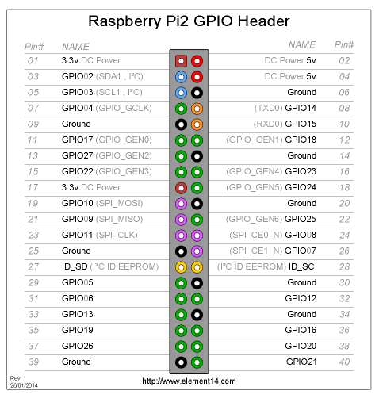

# Accessing Raspberry Pi 2 GPIOs from c-code  
This part of the RPi repository is intended to contain information about accessing the PRi IO pins from c-code rather than Python or other wrapper script-based means.
As the RPi IO pins are generally "addrresses" from the Raspbian kernel or other Linux like OS kernel, it is usually necessary to use some kind of c-library to get the pin-access needed.  

There are at least two usefull c-libraries that can be used to simplify the RPi IO pin access, and these are BCM2835 and WiringPi, both not officialy maintained, but still usefull for simple input/output pin access.  

The one single and often main issue using the IO pins (Broadcom's GPIOs) on the RPi, is that it is NOT strait forward to access the IO pin of choice, as terms and teminology is used with great divercity.

The reason for this, might be that different people have different MCU backgrounds and preferences, and therefore tend to use their own way of mapping hardware, registeres and funtions for these IO pins. - just a guess... 

This README attempts to sort out this issue by describing how to access the IO pin of choice, at least when using the c-libraries mentioned above. 

<table><tr><td>

 <b>RPi 40-pin header</b>
 
 Notice the header pins that are linked to text in parenthesis.
 
 The GPIO_GENx referers to a specific mode register for this  
 particular header pin.
 
 This is also refrenced as __wiringPi-pin__ and the notation might  
 be wiringPi0 = GPIO_17(GPIO_GEN0) = J8-header pin 11  
   
 So, when using the __WiringPi c-library__, reference the  
 GPIO_GEN-number in order to access the RPi IO pin places  
 in the header-pin number this  
 ...  
 more TBD
 ...  
 ...  
 ...  
 ...  
 ...  
 ...  
 ...  
 ...  
 ...    
 

  </td>
   <td style="width:50%;"></td>
 </tr>
</table>

## Various libraries for managing the GPIO ports on the Raspberry Pi device
More to be described...
