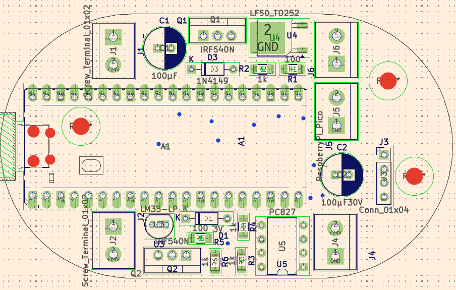
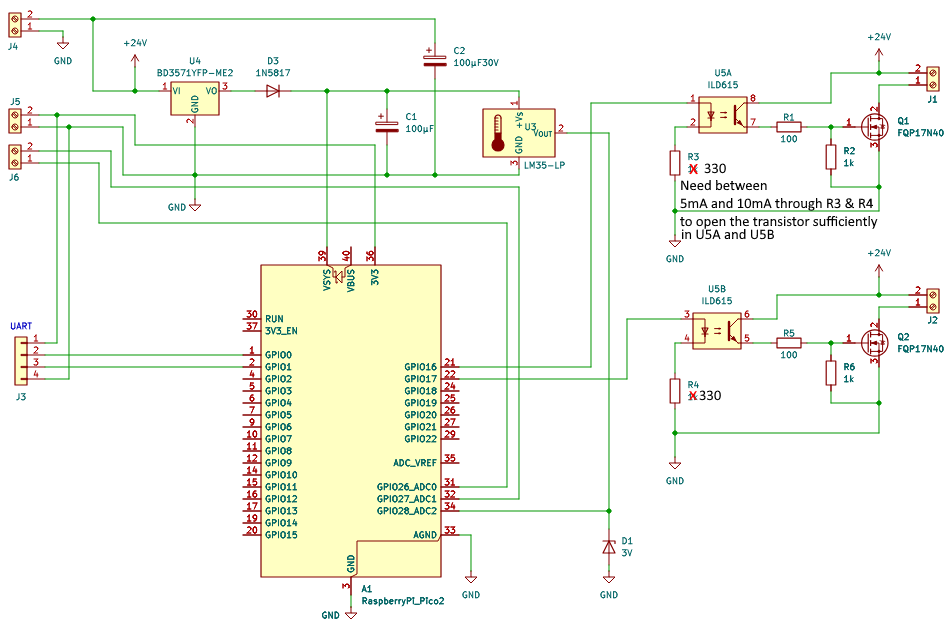
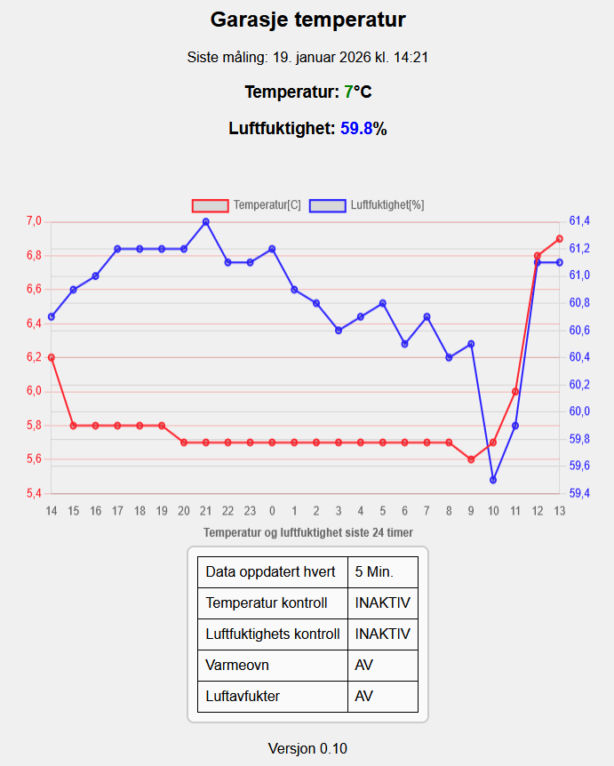
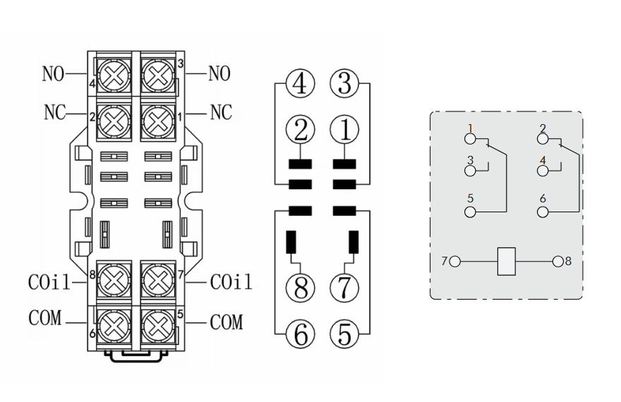

# MicroPython project for the Pico 2 W device  
Tiny IoT prosjects  
## htControll
__Indoor humidity and temperature control__  
htControl is a RPi Pico w MicroPython project which is to monitor humidity and temperature by the use of a simple humidity and temperature sensor.  
The plan is to control a dehumidifier and heater to prevent freezing temperature and too humid indoor environment.  

For this, a number of environment variables are defined to manage dehumidifier and heater.  
The sensor readings is to be matched with humidity and temperature thresholds in order to turn on or to turn off the dehumidifier and or heater.  

The dehumidifier operation, is controlled by the ```humidityHighThreshold``` and ```humidityLowThreshold```.  
When the measured humidity is equal or __above__ the ```humidityHighThreshold```, the dehumidifier is automatically turned ON.  
When the measured humidity is equal or __below__ the ```humidityLowThreshold```, the dehumidifier is automatically turned OFF.

The heater operation, is controlled by the ```TemperatureHighThreshold``` and ```TemperatureLowThreshold```.  
When the measured temeprature is equal or __above__ the ```TemperatureHighThreshold```, the heater is automatically turned OFF.  
When the measured temeprature is equal or __below__ the ```TemperatureLowThreshold```, the heater is automatically turned ON.  

The physical interface that will turn on or off the dehumidifier and or heater is marked J1 and J2 on the circuit board outline. 
These screw-terminals is part of an open drain MOSFET, sourced with 12V or 24V supply, which is turn should be connected to a relay operating the mains power to the dehumidifier and or heater.  

picture of the complete hardware solution to be shown here...   

These thresholds can be set from the units serial command line interface.  

## Hardware brief
Based on Raspberry Pi Pico board mounted on a I/O controller board for interfacing sensors and actuators.  



Circuit board outline and component placements  

  

Circuit board schematics  

### Monitoring Humidity and temperature
Humidity and temperature monitoring for indoor humidity and temperature control,
by the use of AOSONG AM2320 temperature and humidity i2c sensor, and a simple 
high-level driver in am2320.py.  
  
AOSONG AM2320 temperature and humidity i2c sensor  

### i2c connection for the AM2320 on Pico 2 W  
The following screw-terminals on the PCB is used for the humidity and temperature sensor:  
- SDA to Pico 2 W GPIO 26 @screw-terminal#1 on __J6__  
- SCL to Pico 2 W GPIO 27 @screw-terminal#2 on __J6__  
- VDD to 3.3V	@screw-terminal#2 on __J5__  
- GND to ground	@screw-terminal#1 on __J5__  
- A 5.6 kΩ pull-up resistor between VDD and SDA and SCL.  

### Monitor and configuration option via Pico UART
To monitor and change system configuration, the board provides a simple UART serial port pin header connector (__J3__), which is wired to Pico's UART0 pins GPIO0 (TX) and GPIO1 (RX).  
The serial port is set to 9600 baud with 1 start-bit, 1 stop-bit and no parity.  
Note that:  
- pin#1 = 3V3
- pin#2 = TX
- pin#3 = RX
- pin#4 = GND  

## Software brief
The software that provides and supports the overall functionality is assembled by a set of Python scripts.    
 
### MicroPyton for Raspberry Pi Pico
The MicroPython Firmware for Raspberry Pi Pico 2 W is downloaded from https://micropython.org/download/RPI_PICO2_W/  

### Basic concept
In general, the system implementation, will launch two asynchronus threads, one for periodically reading the sensor data and one that attempts to keep the wifi connection alive.  
The Pico 2 W device's network connectivity and operation is dependent of a onboard configuration file,  
config.json, which have the following format:
```
{
    "version": "0.1",
    "wifi":{
        "SSID":"someSSID",
        "PASSWORD":"somePASSWORD",
        "attempts":10,
        "freq":10
    },
    "url":"SomeURL"
    "postInt": 5,
    "envctrl":{
        "humidityCtrl":"disabled",
        "tempCtrl":"disabled",
        "humidityHighThreshold":"80",
        "humidityLowThreshold":"70",
        "TemperatureLowThreshold":1,
        "TemperatureHigThreshold":10
    },
}
```  
All of the parameters in this config file is changeable from the Pico 2 W serial port command line interface (UART on GPIO0 and GPIO1).  
The following commends are currently abaliable:  
- help &emsp;&emsp;&emsp;&emsp;&emsp;&emsp;&emsp;This information
- info &emsp;&emsp;&emsp;&emsp;&emsp;&emsp;&emsp;Shows info about the system  
- config &emsp;&emsp;&emsp;&emsp;&emsp;&emsp;Shows contents of config.json
- url=\<url> &emsp;&emsp;&emsp;&emsp;&ensp;Changes URL in config.json to \<url>
- postInt=\<int>&emsp;&emsp;&emsp;Number of minutes between POSTs 
- ssid=\<ssid> &emsp;&emsp;&emsp;&ensp;Changes SSID in config.json to \<ssid>
- password=\<pwd>&emsp;Changes PASSWORD in config.json to \<pwd>
- attempts=\<int>&emsp;&emsp;Number of WiFi reconnection attempts (default: 10)
- freq=\<int>&emsp;&emsp;&emsp;&emsp;Sleep interval between each bulk of reconnection attempts (default: 10min)
- restart &emsp;&emsp;&emsp;&emsp;&emsp;&emsp;Restarts the pico
- version&emsp;&emsp;&emsp;&emsp;&emsp;&emsp;Shows current version
- humidityControl=\<enabled | disabled>&emsp;&emsp;&emsp;&ensp;Humidity control ON/OFF
- temperatureControl=\<enabled | disabled>&emsp;&emsp;Temperature control ON/OFF
- humidityHigh=\<int>&emsp;High humidity level threshold for switch ON
- humidityLow=\<int> &emsp;Low humidity level threshold for switch OFF
- tempHigh=\<int>&emsp;&emsp;&ensp;High temperature level threshold for heater OFF
- tempLow=\<int>&emsp;&emsp;&emsp;Low temperature level threshold for heater ON

Example:  
TBD

### AM2320 driver
Luckely a driver for the AOSONG AM2320 temperature and humidity i2c sensor, was available at:  
https://github.com/mcauser/micropython-am2320  
So, minimal effort to integrate this device into the system. Just needed to select SDA and SCL on the Pico board (those that already was wired to two screw-terminals) and import the I2C in addition to other parts needed from the machine library...  

### Publishing environment climate data
As indicated above, the unit monitors the environment it is placed in periodically, and sends the sensor data to a web server.  
The data is sent over the HTTP REST interface by POSTing the sensor values with a timestamp as a json-formated string, formated as follows:  
```
{
    "Time": 1767806468, 
    "Temperature": 19.3, 
    "Humidity": 38.5, 
    "PostInterval": 3, 
    "HumidityControl": "disabled", 
    "TemperatureControl": "disabled", 
    "Dehumidifier": 0, 
    "Heater": 0}
```
... but will not necessararly be sent in this order.  

The above info will then be organized and stored on the addressed web server in the following structure: 
(No database used, only a single limited sized file is used to store the information.)
```
{
    "Timestamp": 1767440462,
    "Measurement": {
        "Humidity": 34.8,
        "Temperature": 20.9
    },
    "PostInterval": 3,
    "TemperatureControl": "enable",
    "Heater": 0,
    "HumidityControl": "disabled",
    "Dehumidifier": 0
}
```

### Humidity and Temperature visualization 
The humidity and temperature is to be rendered graphically showing the humidity and temperature in a time scaled diagram.  
Other system parameters, which is configurable as mentioned before, are also published on the web.  
  
The sensor arrangement will publish a single measurment value for both temperature and humidity, as indicated on the web-page, every 5 minutes.  
The data is then used to calculate the hourly temeperature and humidity avarage, which is to be presented as a 24 hour temeprature and humidity graph.  

### Tests used on Windows
Using a simple test to ensure that the backend is reponding as expected.  
curl -X POST -H "Content-Type: application/json" -d "{\"Time\": 1764772947, \"Humidity\": 71.8, \"Temperature\": 21.8}" "http://someURL"

## htControl Solution  
...picture to be inserted here...

### 230V 10A Relay for heater on/off control  
Sealed Miniature 8 Pin Relay Socket For Ly2 Industrial General Purpose Relay  
  


NNC Sealed Miniature PTF08A 8 Pin Relay Socket for LY2 Industrial General Purpose Relay
  

All put toghether  
...
  


