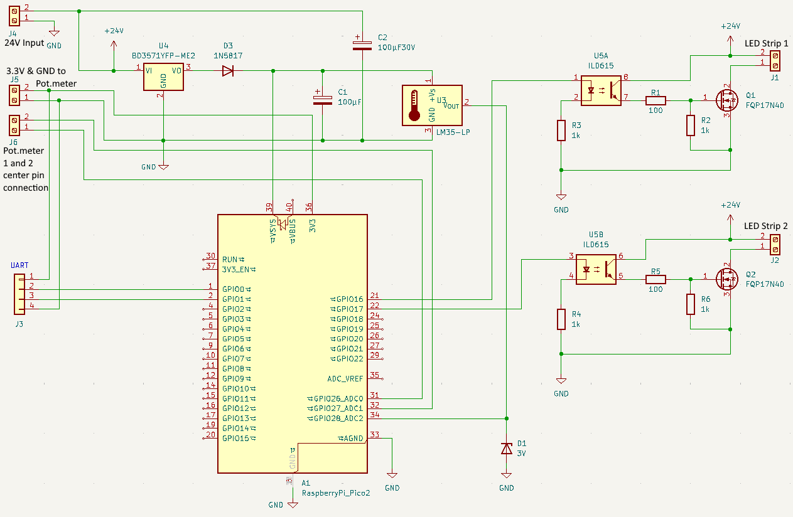

# LED Strip Driver Controller
## The hardware  
  

As seen in the picture above, the driver hardware is based on the Raspberry Pi Pico 2, which is a low-cost, high-performance microcontroller board with flexible digital interfaces.  

The Pico2 is connected to the LED Strip power board, using UART, PWM and Analog interfaces on the controller board.
The power board includes:  
- two individual MOSFET transistors for providing 24V PWM power to each LED Strip
- a linear temperature sensor, using ADC2
- 24V to 5V power converter (LDO)
- UART interface for monitoring and handling a few commands
- two individual ADCs (ADC0 and ADC1) for measuring the voltage from a slid potentiometer, used to controlling the PWM signals on the MOSFET gates.
- 6 screw terminals for 24V DC input (2), 3.3V DC for potentiometer endpoints (2), and ADC inputs from the slid potentiometers (2).
- 4 screw terminals for LED Strip1 (2) and LED Strip2 (2)  

The power board is designed in KiCad and the PCB is manufactured at PCBWAY.  
The form factor is based on the wall-box size 1.5, intended for the driver to be placed in such wall-box.  

  
Schematics captured from kiCad  


## Brief function description
The Driver is powered by a 230V AC to 24V DC converter that will be the power supply for two 3.5 meter dimmable LED Strips (14W/m). Each LED Strip's brightness, is controlled by a wall-mounted slide potentiometer, which will set the PWM duty cycle of the MOSFET (FQP17N40) gate signal, based on the measured voltage on the potentiometers center pin.  
The LED Strip Driver Controller has also a UART interface (9.6k baud) that can be connected to another computer with serial line interface. It is then  possible to disable the potentiometer functionality and adjust the LED Strips brightness by setting the duty cycle from the command promt.  
All terminal commands are described below.  


## The software
The software that operates the Pico2 board as indicated above, is written in c and made as (stupid) simple as possible.  
It makes use of a small amount of Pico2 library functions for UART, ADC readings and managing the PWM slices within the RP2350 based board.  
As indicated, the code will run in a "main-loop" (for-ever while-loop), only interrupted by the UART receiver, if the user for any reason whats to execute one of the below described commands.  

The main-loop checks/reads the slid potentiometers position every 100 ms, and if different from the previous check, the PWM duty cycle is updated according to the new potentiometer position to change the LED Strip brightness accordingly. The source of the input voltage is the center pin of a linear 10 kΩ slid potentiometer, which the endpoints are connected to 3.3V and GND. The PWM duty cycle are set proportional to the voltage read on two GPIOs configured as analog input, although limiting the duty cycle to maximum 60% due to the limitation of the AC to DC power converter.  In addition to checking/reading the potentiometers center pin voltage, the temperature sensor output is also read every 100 ms. This is to monitor the temperature in the close surroundings of one of the MOSFET (Q1) in order to detect any indication of a over heated situation. If this occurs (over 50 C°), then the PWM duty cycle is set to 10% and if the temperature does not reduces to less than 30 C° within 5 minutes, then the system shuts down. Only power cycle will start the system again.

The UART provides a simple command-line user interface to read system status information and send simple commands for PWM duty cycle for each LED strip driver.

## Terminal commands
```led1```  - will give the current PWM duty cycle for the LED strip #1
```
pico2>led1  
ADC0 (LED1) DutyCycle: 15 %  
```  
```led2```  - will give the current PWM duty cycle for the LED strip #2
```
pico2>led2  
ADC1 (LED2) DutyCycle: 15 %  
```  
```temp```  - will give the current temperature near the Q1 MOSFET transistor.  
```
pico2>temp
ADC2 temp: 24.3 C°  
```  
Disabling the potentiometer control if digital control is wanted.  
Enabling the potentiometer if potentiometer control is wanted.  
```pot <on|off>```  - will give the current PWM duty cycle for the LED strip #2
```
pico2>pot off
Potmeter OFF  
```  
```
pico2>pot on
Potmeter ON  
```  
Setting the PWM duty cycle from the terminal if the potentiometer is disabled.  
```dc<1|2> duty cycle>```  - will set the duty cycle for LED strip 1 or 2
```
pico2>dc2 50
ADC1 (LED1) DutyCycle: 15 %  
```  